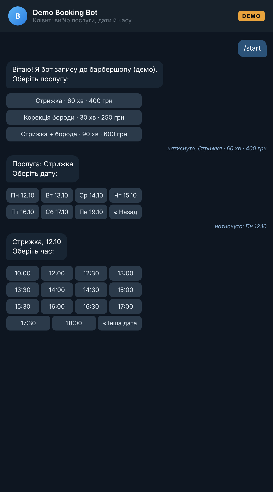
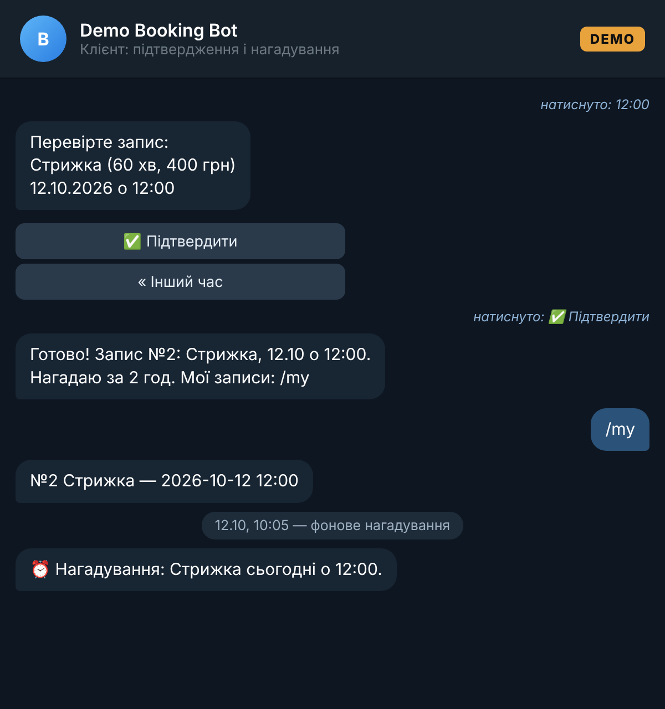
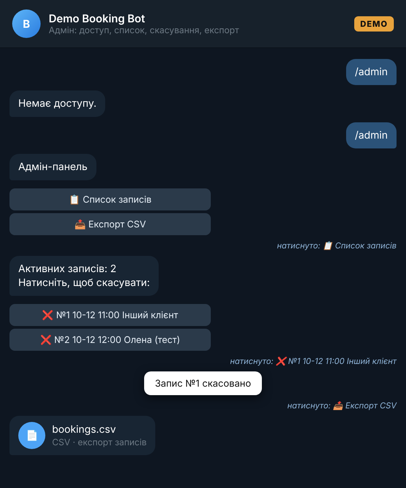

# Demo Booking Bot — Telegram-бот запису на послуги (aiogram 3)

> **Демо-проєкт для портфоліо.** Не є роботою для реального клієнта; барбершоп, послуги й ціни вигадані для прикладу.

Клієнт обирає послугу → дату → вільний слот → підтверджує запис. Бот нагадує за N годин.
Адміністратор у `/admin` бачить список записів, скасовує їх однією кнопкою та вивантажує CSV.

## Можливості
- Inline-клавіатури, крок «Назад» на кожному етапі
- Логіка слотів: робочі години, крок 30 хв, різна тривалість послуг, вихідний день, приховування минулого часу
- Захист від подвійного бронювання: перевірка перетину всередині транзакції SQLite (`BEGIN IMMEDIATE`)
- `/my` — мої записи
- `/admin` (лише для `ADMIN_IDS`): список, скасування, експорт CSV
- Фонові нагадування (`REMINDER_HOURS`), кожне надсилається один раз
- SQLite, без зовнішніх сервісів

## Запуск з реальним ботом
```bash
python -m venv .venv && . .venv/bin/activate
pip install -r requirements.txt
cp .env.example .env   # вкажіть BOT_TOKEN від @BotFather і свій Telegram ID у ADMIN_IDS
set -a; . ./.env; set +a
python -m bot.main
```

## Демо-режим без токена
```bash
python -m demo.run_demo     # проганяє СПРАВЖНІ хендлери через фейкову сесію Telegram API → demo/transcript.json
python demo/render.py       # рендерить скриншоти чату в screenshots/ (потрібен google-chrome)
```
Сценарій: клієнт записується на 12:00 (слот 11:00 уже зайнятий іншим), отримує нагадування;
не-адмін отримує відмову в `/admin`; адмін переглядає список, скасовує запис і вивантажує CSV.

## Тести
```bash
pip install -r requirements-dev.txt && python -m pytest -q
```
Покрито: генерацію слотів, перетини, межі робочого дня, минулий час, вихідні, заборону подвійного запису, скасування, експорт і вибірку нагадувань.

## Структура
```
bot/config.py     налаштування, послуги, графік
bot/slots.py      чиста логіка слотів (без Telegram)
bot/db.py         SQLite: записи, скасування, нагадування, CSV
bot/handlers.py   клієнтський сценарій + адмін-панель
bot/reminders.py  фонові нагадування
bot/main.py       запуск polling
demo/             мок-режим і рендер скриншотів
```

## Скриншоти (мок-чат, згенеровано з реального прогону хендлерів)



